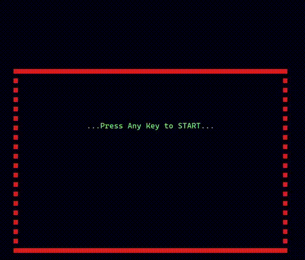
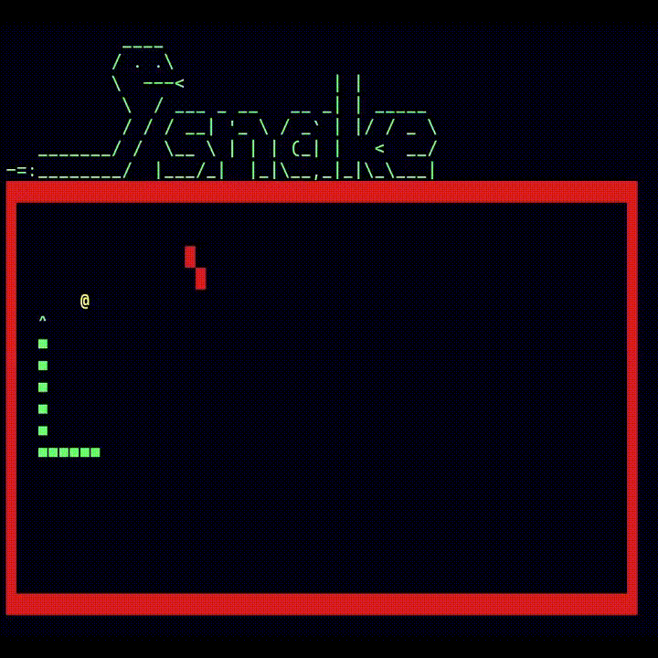
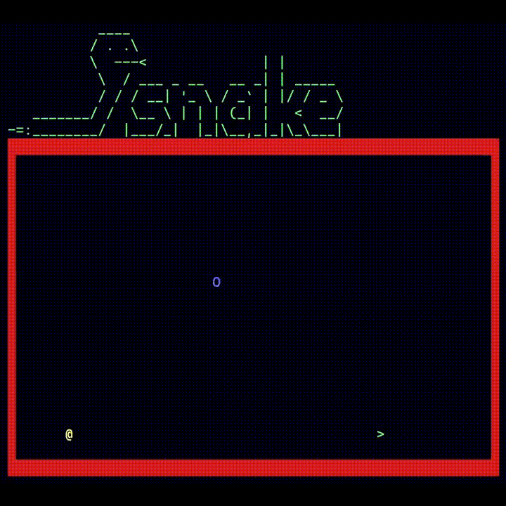

# Classic Snake Game

Basic snake game in C#

> !! IMPORTANT: To play game appropriately, use **windows terminal app** and be sure game's border fits into your buffer.
>>
>> * Windows terminal app > Startup > Set Launch Size
>> * Windows terminal app > Appearance > Font Size
>> * You could zoom in/out.

## Libraries Used

**NAudio** used for game sounds.

	

## Game Modes

### Normal Mode

In this mode, you will encounter an obstacle every time you eat 5 food.

	

### AI Mode (Meet Your Brother!)

In this mode you are in a race with your brother.

	

## Play

***Move snake*** ***=>*** ``Up``, ``Down``, ``Left``, ``Right Arrow``, ``W``, ``A``, ``S``, ``D``

***Toggle Boost Mode*** ***=>*** ``Space``

***Toggle Sound*** ***=>*** ``M``

***Pause Game*** => ``P``

***To Quit*** => ``Q``
